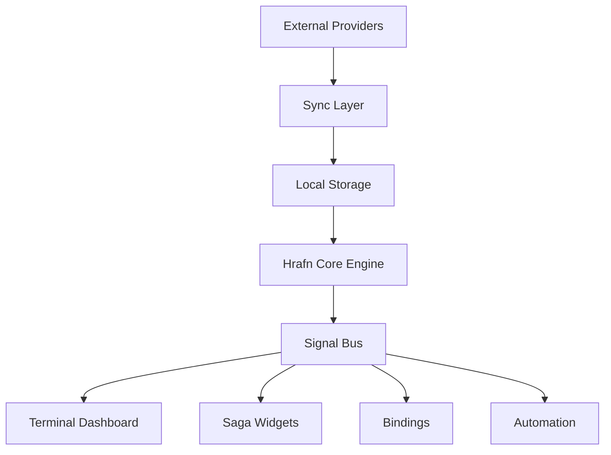
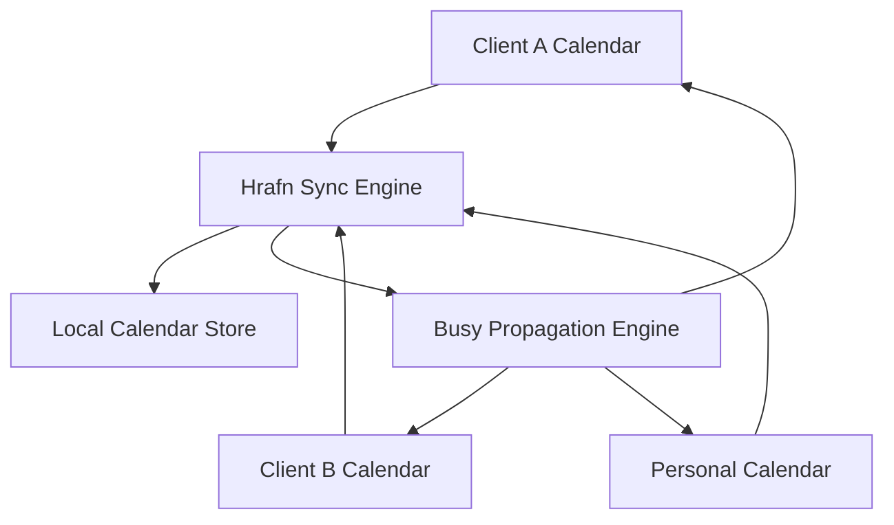

# Hrafn
### SagaOS Terminal Intelligence Layer

**Status:** Concept / Early Architecture  
**Project:** SagaOS Module  
**Philosophy:** Terminal-first operational awareness

---

# Overview

**Hrafn** is a terminal-first operational signal engine for SagaOS.

It aggregates signals from calendars and task systems, computes deterministic insights about time and workload, and exposes those insights as structured signals that power:

- terminal dashboards
- SagaOS widgets
- automation
- bindings
- future AI augmentation

Instead of acting as a traditional productivity tool, Hrafn acts as a **personal operational awareness layer**.

The name comes from the Norse raven (*Hrafn*), a symbol of intelligence gathering and situational awareness.

---

# Core Idea

Most productivity systems expose **data**.

Hrafn exposes **signals**.

Example transformation:

```
Calendar events
Tasks
Meeting links

↓

Deterministic computation

↓

Signals
meeting_in_10_minutes
focus_window_available
schedule_overloaded
tasks_due_today
client_load_high
```

These signals power dashboards, widgets, and automation across SagaOS.

---

# Key Capabilities

Hrafn provides five core capabilities.

### Calendar Aggregation

Hrafn aggregates multiple calendars into a unified view.

Supported providers:

- Google Calendar
- Microsoft 365
- CalDAV
- Nextcloud

Users can view their **entire day across all accounts** from the terminal.

---

### Cross-Calendar Busy Sync

Hrafn coordinates availability across calendars to prevent double booking.

When an event exists in one calendar, Hrafn propagates **busy blocks** to the others.

Example:

```
Client A calendar
09:00 – 10:00 Architecture Meeting

Client B calendar
09:00 – 10:00 Busy (external)

Personal calendar
09:00 – 10:00 Busy
```

This ensures that scheduling systems see accurate availability across all calendars.

Privacy is preserved by mirroring **busy-only blocks**.

---

### Task Integration

Tasks integrate with Hrafn using Taskwarrior.

Features:

- due dates
- priorities
- projects
- tags
- cross-machine sync

Tasks remain separate from calendar events but are considered in workload insights.

---

### Deterministic Insight Engine

Hrafn computes schedule intelligence using deterministic algorithms.

Examples:

- meeting density
- focus windows
- workload distribution
- task pressure
- client calendar load

No AI or ML is required for the core system.

All insights are computed locally.

---

### Signal Engine

Hrafn emits signals describing operational state.

Examples:

```
meeting_starting_soon
meeting_live
task_overdue
focus_window_available
schedule_overloaded
calendar_sync_complete
```

Widgets, dashboards, and automation subscribe to these signals.

---

# Architecture Overview



---

# Cross-Calendar Coordination



Busy propagation ensures no scheduling system sees conflicting availability.

---

# Terminal-First Design

The primary interface for Hrafn is the terminal.

Example dashboard:

```
╔══════════════════════════════════════╗
║ HRAFN COMMAND CONSOLE                ║
╠══════════════════════════════════════╣

MEETING RADAR
09:00 Client A Standup
11:30 Architecture Review
14:00 Client B Planning

NEXT EVENT
Client A Standup
T-00:11:42

TASK MATRIX
MeetingScore ██████░░
NVL ████████
Ops ███░░░░

SYSTEM
calendar sync ✓
task sync ✓
alerts 3
```

---

# Widget-Ready Architecture

Hrafn is UI-agnostic.

It exposes structured outputs:

- terminal rendering
- JSON APIs
- event bus signals

Widgets can later render these signals using whatever UI engine SagaOS adopts.

---

# Build Strategy

Hrafn is designed to be built progressively.

### Layer 1 — Calendar Sync

Goal:

```
See my day across all calendars in the terminal.
```

Features:

- calendar sync
- unified agenda

---

### Layer 2 — Task Integration

Add:

- Taskwarrior tasks
- due date awareness

---

### Layer 3 — Meeting Intelligence

Add:

- next meeting detection
- meeting join
- countdown signals

---

### Layer 4 — Deterministic Insights

Add algorithms for:

- meeting density
- focus windows
- workload distribution
- task pressure

---

### Layer 5 — Signal Bus

Emit signals for:

```
meeting_starting_soon
focus_window_available
schedule_overloaded
```

---

### Layer 6 — Widgets

Expose signals to SagaOS widgets.

---

### Layer 7 — AI Augmentation (Optional)

Future optional components:

- meeting summaries
- task extraction
- schedule suggestions

These run asynchronously and are not required for core functionality.

---

# Philosophy

Hrafn transforms the terminal into a **personal operations console**.

Instead of scattered tools and hidden schedules, users gain a unified view of their time and workload.

Like Odin's ravens, Hrafn gathers signals from the digital world and returns them as intelligence.

---
