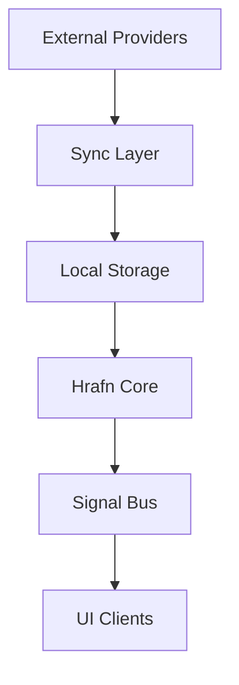
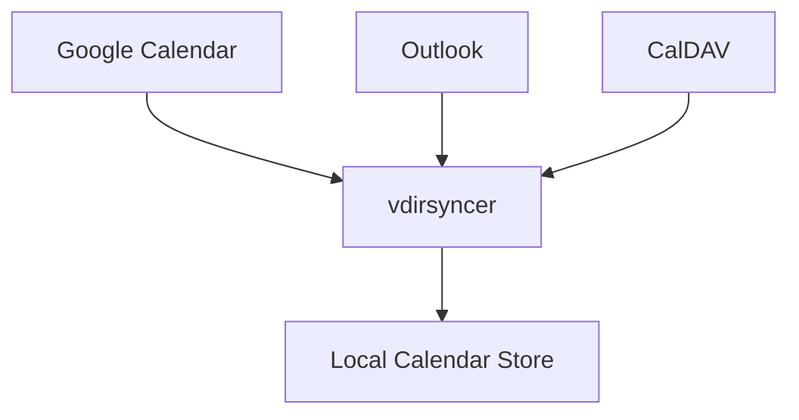
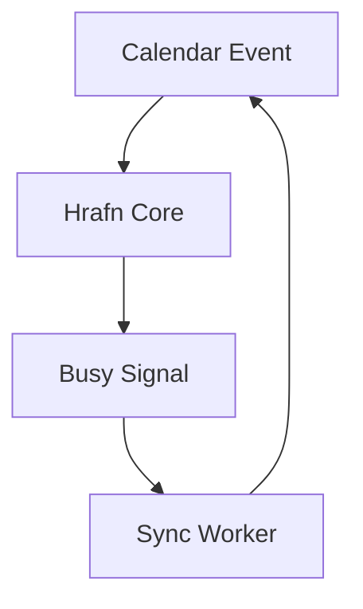
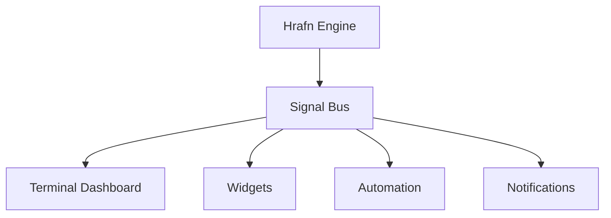

# Hrafn Technical Design
### Tooling and Architecture Evaluation

This document evaluates the technical approaches for implementing Hrafn.

It focuses on:

- calendar sync
- task integration
- event bus design
- busy propagation
- terminal UI
- widget compatibility

---

# System Architecture



---

# Calendar Sync Options

Hrafn needs reliable multi-calendar synchronization.

### Option 1 — vdirsyncer

Purpose:

CalDAV sync tool.

Advantages:

- open source
- widely used
- reliable
- local storage model
- integrates with khal

Disadvantages:

- complex config
- limited provider-specific features

Best use:

Primary calendar sync engine.

---

### Option 2 — Direct Provider APIs

Examples:

- Google Calendar API
- Microsoft Graph API

Advantages:

- full control
- provider-specific features
- easier busy propagation

Disadvantages:

- vendor lock-in
- authentication complexity
- maintenance overhead

Best use:

Optional provider-specific enhancements.

---

### Recommended Approach

Use **vdirsyncer as the core sync layer**.

Architecture:



---

# Calendar Visualization

### khal

Purpose:

Terminal calendar viewer.

Advantages:

- terminal-first
- lightweight
- works with vdirsyncer

Disadvantages:

- limited UI customization

Recommendation:

Use khal for baseline terminal viewing.

---

# Task System Options

### Taskwarrior

Advantages:

- mature
- terminal-first
- powerful filtering
- taskserver sync

Disadvantages:

- learning curve

Recommendation:

Use Taskwarrior as primary task backend.

---

# Busy Propagation Options

### Option A — Hrafn writes busy events

Pros:

- simple architecture

Cons:

- risks recursion loops
- harder to debug

---

### Option B — Hrafn emits busy signals

Pros:

- cleaner architecture
- easier testing
- fits event-driven model

Recommendation:

Use **Option B**.

Architecture:



---

# Signal Bus Architecture

Hrafn exposes an internal event system.

Example signals:

```
meeting_starting_soon
meeting_live
task_overdue
focus_window_available
schedule_overloaded
calendar_sync_completed
```

Architecture:



---

# Deterministic Insight Algorithms

Insights are computed locally using simple algorithms.

### Meeting Density

```
meeting_density = total_meeting_minutes / workday_minutes
```

---

### Client Load

```
client_load = meeting_time_by_calendar
```

---

### Focus Windows

```
focus_window = next_meeting_start - previous_meeting_end
```

---

### Task Pressure

```
task_pressure = tasks_due_today / available_hours
```

---

# UI Options

Hrafn must support terminal and widget UI.

### Terminal Dashboard

Options:

- bash + ANSI
- rich (Python)
- textual
- go-tui

Recommendation:

Start simple with terminal rendering.

---

### Widget Engines (Future)

Possible Saga widget engines:

- Waybar
- EWW
- AGS
- Textual dashboards

Hrafn should remain **UI-agnostic**.

---

# Event Bus Implementation Options

Possible technologies:

### Unix sockets

Pros:

- simple
- fast
- native

### Redis pub/sub

Pros:

- scalable
- distributed

Cons:

- external dependency

### Internal in-process bus

Pros:

- simplest

Recommendation:

Start with **internal signal bus**.

---

# Future AI Components

AI features should be optional.

Examples:

- meeting summaries
- action item extraction
- schedule recommendations

These should run asynchronously and never block core functionality.

---

# Recommended Stack

```
Calendar Sync: vdirsyncer
Calendar UI: khal
Tasks: Taskwarrior
Signal Engine: Hrafn Core
UI: terminal-first
Widgets: Saga widget layer
```

---

# Development Strategy

Build incrementally.

```
Phase 1
calendar sync
agenda view

Phase 2
tasks

Phase 3
meeting signals

Phase 4
deterministic insights

Phase 5
signal bus

Phase 6
widgets

Phase 7
AI augmentation
```

---

# Final Design Philosophy

Hrafn is not a productivity app.

It is a **signal processor for time**.

Its job is to convert calendars and tasks into actionable operational intelligence.

---
